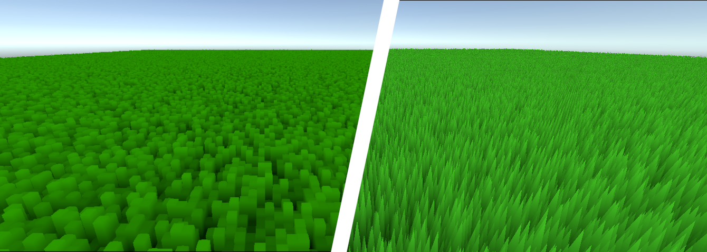

# Shell Texturing for Real-time Grass Simulation
This project was created as part of the course DH2323 Computer Graphics and Interaction.

## What is Shell Texturing?
Shell texturing is a technique for simulating surface textures such as grass, fur or hair. It is most commonly used in real-time applications where performance is a priority. The technique works by layering semi-transparent shells that appear to form a convincing complex surface when viewed from most angles. This project explores a simple and minimalistic implementation of the technique in Unity using HLSL to simulate grass.

